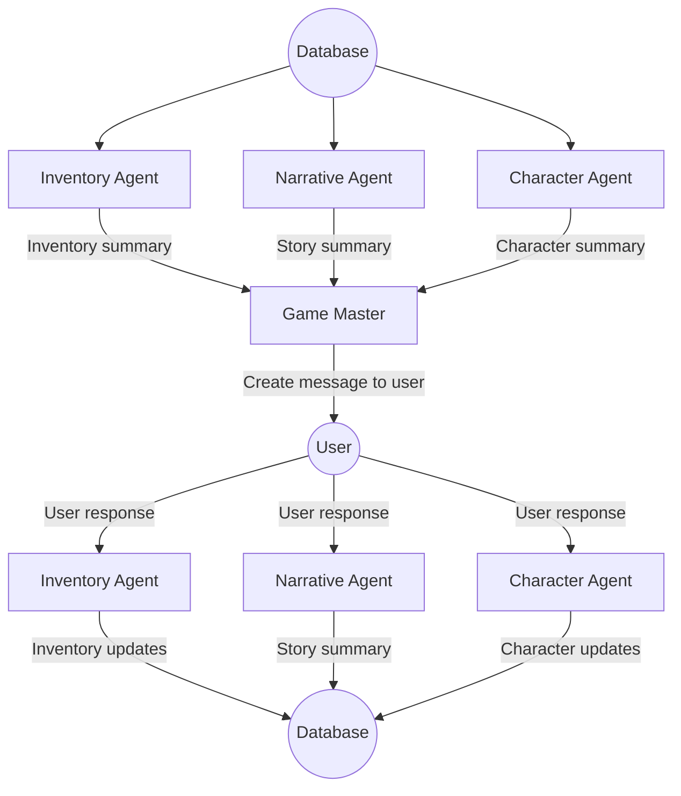

# Game loop

```mermaid
flowchart TB
    %% Top: Database
    A((Database))
    
    %% Top Agents
    A --> B[Inventory Agent]
    A --> C[Narrative Agent]
    A --> D[Character Agent]

    %% Summaries to Game Master
    B -- Inventory summary --> E[Game Master]
    C -- Story summary --> E[Game Master]
    D -- Character summary --> E[Game Master]

    %% Message to User
    E -- "Create message to user" --> F((User))

    %% User Response to Agents
    F -- "User response" --> G[Inventory Agent]
    F -- "User response" --> H[Narrative Agent]
    F -- "User response" --> I[Character Agent]

    %% Bottom Agents
    G -- "Inventory updates" --> J
    H -- "Story summary" --> J
    I -- "Character updates" --> J

    %% Updates back to Database
    J((Database))
```
